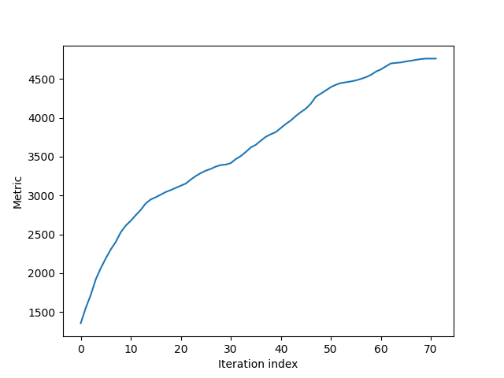

## Robust-decomposition-of-3-way-tensors-based-on-L1-norm


We consider 3-way tensor --i.e., a collection of 2-way measurements (matrices) collated across mode-3-- and implement AM-L1-Tucker2 algorithm of [[1]](https://doi.org/10.1117/12.2307843) for L1-norm Tucker2 (L1-Tucker2) decomposition (joint processing of the 2-way measurements) of the processed tensor. L1-Tucker2 of 3-way tensors is formulated as


---

SPIE Digital Library: https://doi.org/10.1117/12.2307843

---

**Examples**

We consider 3-way tensor --i.e., a collection of 2-way matrices across the tensor's mode-3.


```python
import numpy as np
import matplotlib.pyplot as plt
import algorithm as l1tucker2
from scipy import linalg
from utils import *
D = 20
M = 25
N = 20
data_tensor = np.random.randn(D, M, N)
```
Then, we fixe the rank of the factor matrices --number of components-- and create one random factor per mode that can optinally be given as input to AM-L1-Tucker2.

```python
number_of_components = 8
left = linalg.orth(np.random.randn(D, number_of_components))
right = linalg.orth(np.random.randn(M, number_of_components))
```
Next, we call AM-L1-Tucker2 on the data tensor with no user-defined initialization factors.

```python
# ===========================
# Example 1 -- AM-L1-TUCKER2 with no user-defined initialization
U, V, metric_evolution1 = l1tucker2.am_l1_tucker2(data_tensor, number_of_components)
```

We illustrate the metric evolution across iterations. 
```python
plt.figure()
plt.plot(metric_evolution1)
plt.xlabel('Iteration index')
plt.ylabel('Metric')
plt.show()
```


Similarly, we call AM-L1-Tucker2 with either one or two user-defined initialization factors. 
```python
# ===========================
# Example 2 -- AM-L1-TUCKER2 with user-defined initialization of the left-side factor
U, V, metric_evolution2 = l1tucker2.am_l1_tucker2(data_tensor, number_of_components, left)
plt.figure()
plt.plot(metric_evolution2)
plt.xlabel('Iteration index')
plt.ylabel('Metric')
plt.show()
# ===========================
# Example 3 -- AM-L1-TUCKER2 with user-defined initialization of both factors
U, V, metric_evolution3 = l1tucker2.am_l1_tucker2(data_tensor, number_of_components, left, right)
plt.figure()
plt.plot(metric_evolution3)
plt.xlabel('Iteration index')
plt.ylabel('Metric')
plt.show()
# ===========================
```
---
**Questions/issues**

Inquiries regarding the scripts provided are cordially welcome. In case you spot a bug, please let me know.

---
**Citing**

If you use our algorithms for your own work, please cite [[1]](https://doi.org/10.1117/12.2307843).

```bibitem
@inproceedings{chachlakis2018robust,
  title={Robust decomposition of 3-way tensors based on L1-norm},
  author={Chachlakis, Dimitris G and Markopoulos, Panos P},
  booktitle={Compressive Sensing VII: From Diverse Modalities to Big Data Analytics},
  volume={10658},
  pages={1065807},
  year={2018},
  organization={International Society for Optics and Photonics}
}
```

[[1]](https://doi.org/10.1117/12.2307843) D. G. Chachlakis and P. P. Markopoulos, ``Robust decomposition of 3-way tensors based on L1-norm,” in Proc. SPIE
Def. Comm. Sens., Orlando, FL, Apr. 2018, pp. 1065807:1–
1065807:15.

---
**Related works**

The following works might be of interest:

* [[2]](https://ieeexplore.ieee.org/document/8910610) D. G. Chachlakis, A. Prater-Bennette and P. P. Markopoulos, "L1-Norm Tucker Tensor Decomposition," in IEEE Access, vol. 7, pp. 178454-178465, 2019, doi: 10.1109/ACCESS.2019.2955134.

* [[3]](https://ieeexplore.ieee.org/document/8646385) P. P. Markopoulos, D. G. Chachlakis and A. Prater-Bennette, ``L1-NORM HIGHER-ORDER SINGULAR-VALUE DECOMPOSITION," 2018 IEEE Global Conference on Signal and Information Processing (GlobalSIP), Anaheim, CA, USA, 2018, pp. 1353-1357, doi: 10.1109/GlobalSIP.2018.8646385.


* [[4]](https://ieeexplore.ieee.org/document/9053701) D. G. Chachlakis, A. Prater-Bennette and P. P. Markopoulos, ``L1-Norm Higher-Order Orthogonal Iterations for Robust Tensor Analysis," ICASSP 2020 - 2020 IEEE International Conference on Acoustics, Speech and Signal Processing (ICASSP), Barcelona, Spain, 2020, pp. 4826-4830, doi: 10.1109/ICASSP40776.2020.9053701.


* [[5]](https://ieeexplore.ieee.org/document/8248754) P. P. Markopoulos, D. G. Chachlakis and E. E. Papalexakis, ``The Exact Solution to Rank-1 L1-Norm TUCKER2 Decomposition," in IEEE Signal Processing Letters, vol. 25, no. 4, pp. 511-515, April 2018, doi: 10.1109/LSP.2018.2790901.

* [[6]](https://ieeexplore.ieee.org/document/8461839) D. G. Chachlakis and P. P. Markopoulos, ``Novel Algorithms for Exact and Efficient L1-NORM-BASED Tucker2 Decomposition," 2018 IEEE International Conference on Acoustics, Speech and Signal Processing (ICASSP), Calgary, AB, 2018, pp. 6294-6298, doi: 10.1109/ICASSP.2018.8461839.

* [[7]](https://doi-org.ezproxy.rit.edu/10.1117/12.2520140) Dimitris G. Chachlakis, Mayur Dhanaraj, Ashley Prater-Bennette, Panos P. Markopoulos, ``Options for multimodal classification based on L1-Tucker decomposition," Proc. SPIE 10989, Big Data: Learning, Analytics, and Applications, 109890O (13 May 2019).

---
